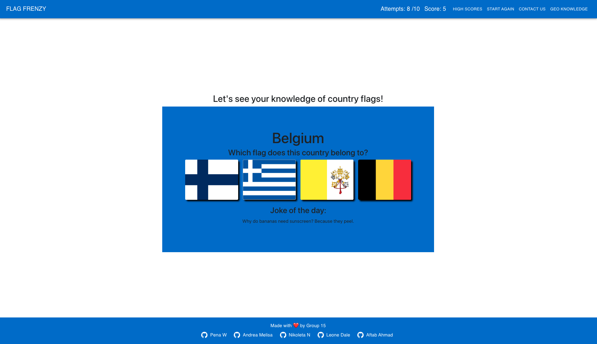
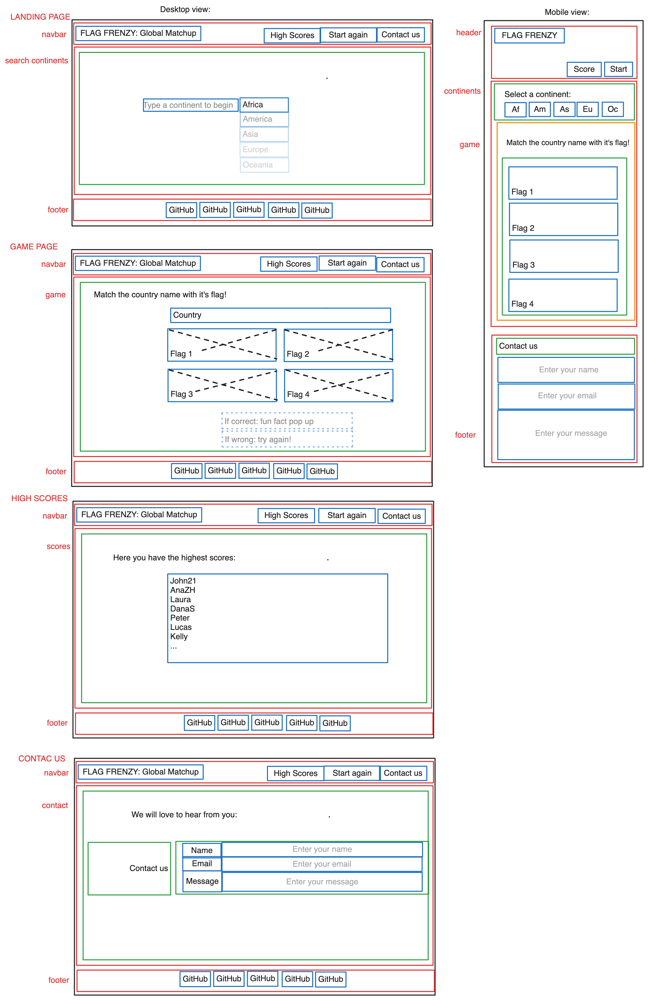

# Flag Frenzy

  

## Description

This is the second group project and also the final one from the edX Bootcamp.
It is supposed to be a "Client-Side Single-Page Application Project" that we’ll be able to showcase to potential employers.

With our group, we’ll conceive and execute a design that solves a real-world problem. In creating our first collaborative front-end, single-page application, we’ll create a React front end to build a user-focused platform. You’ll continue to build on the agile development methodologies you’ve used throughout this course. These include storing your project code in GitHub, managing your work with a project management tool, and implementing feature and bug fixes using the Git branch workflow and pull requests.

For this project, we should start from scratch, allowing us to revisit our front-end abilities in the context of React. 

## Acceptance Criteria

The project must fulfill the following requirements:

- Use React.
- Use Node.js.
- Have both GET and POST routes for retrieving and adding new data (or using local storage)
- Be deployed using Netlify.
- Use at least two libraries, packages, or technologies that we haven't discussed.
- Have a polished front end/UI.
- Meet good quality coding standards (indentation, scoping, naming).
- Have a quality README (with unique name, description, technologies used, screenshot, and link to deployed application).

## User Story

As a user interested in exploring global cultures,
I want an engaging web app game that makes learning about flags fun,
So that I can immerse myself in an enjoyable experience while expanding my knowledge.

## Table of Contents
  1. [Installation](#installation)
  2. [Usage](#usage)
  3. [License](#license)
  4. [Contributing](#contributing)
  5. [Tests](#tests)
  6. [Credits](#credits)
  7. [Badges](#badges)
  8. [Questions](#questions)

  ## Installation
  n/a

  ## Usage

To use the application here you have the link to the deployed webpage: https://flag-frenzy.netlify.app/
And here is the link to the repository: https://github.com/LeoneJD/Flag-Frenzy

Quiz game where the user can show his/her knowledge in country Flags. First need to select the continent and then a county name appears with 4 different flags. The user needs to click on the correct flag, and so on during 10 times. During the game the user can see on the navbar the score and round he has already played. At the end a modal opens to ask for the user name that will go to the High Scores section also in the navbar. There are two other buttons, one to start the game again, and the last one to learn more interesting data about the countries.

Here you have a screenshot from the web page:

And here you have the previous wireframe:

- Technologies used:
HTML, 
CSS, 
JavaScript, 
React, 
Framer Motion,
Material UI (MUI),
Git.

**Here is the link to this project** https://flag-frenzy.netlify.app/

  ## License 
  This project is licensed under the MIT license.

  ## Contributing
  Yes, we are open to new ideas.

  ## Tests
  No specific tests have been written for this project yet.

  ## Credits
Thanks to the instructor Laura Cole and to the TA Martin William from EDX for all their knowledge and support. Thanks to the tutor Juan Delgado.
Also thank you for all the team members, it has been a pleasure to work together sharing ideas and the code.

Sources:

- https://www.pixabay.com (images)

- https://www.flavicon.co (icon)

- https://www.framer.com/motion/

- https://mui.com/

  
  ## Badges

*JavaScript 

*HTML 

*CSS 

*REACT

*Vite

*MUI

*Framer Motion

  ## Questions
  If you have any questions about this repo you can contact us directly:
  
  [Andrea-Melisa](https://github.com/Andrea-Melisa),
  [wpena](https://github.com/wpena),
  [LeoneJD](https://github.com/LeoneJD),
  [aftabhamad888](https://github.com/aftabahmad888),
  [NikkyNiko](https://github.com/NikkyNiko).

